# Discrete-math-project
## App flowchart
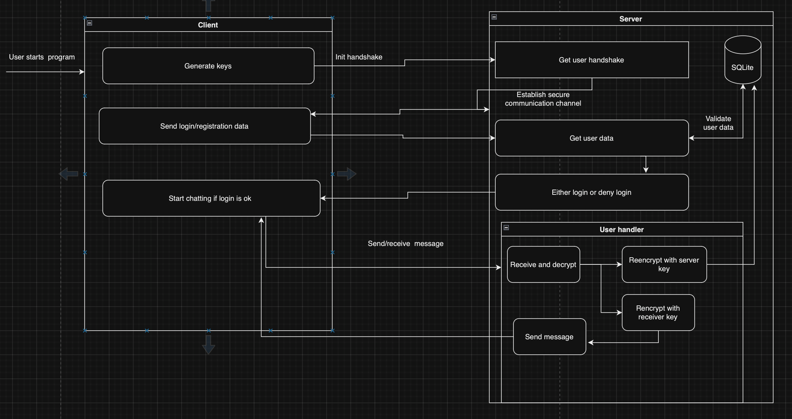

## Database schema
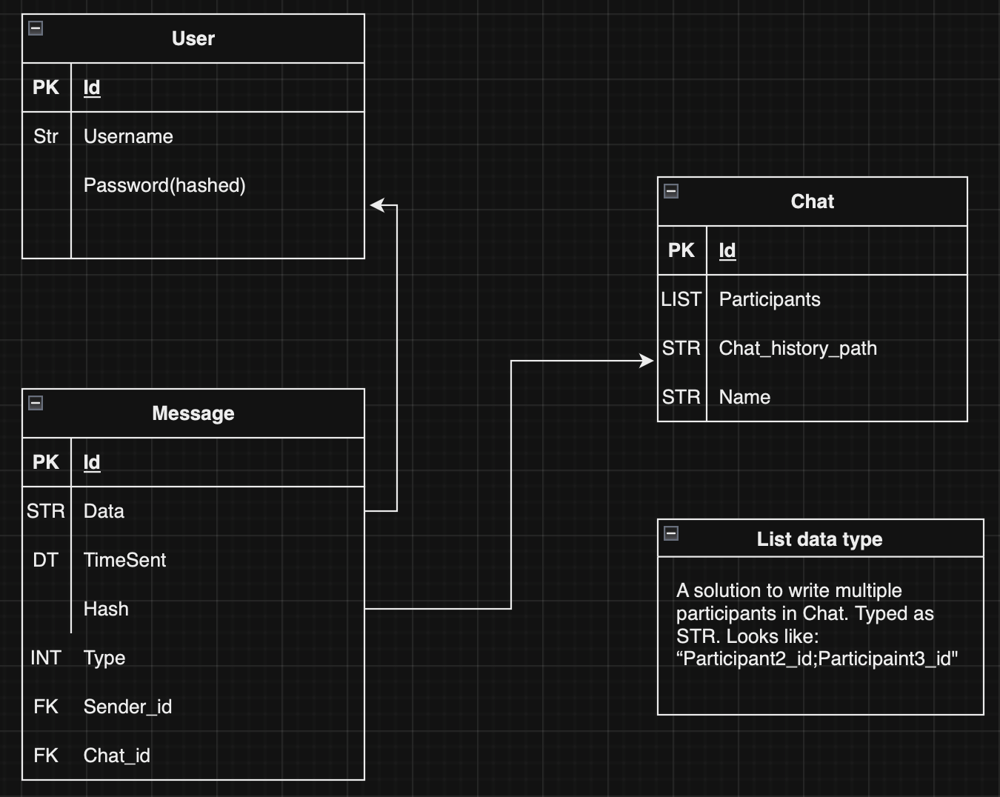

# Developers
- [Ivan Sen](https://github.com/senivan) - Team lead, server development, RSA and ECC implementation.
- [Daniil Bykov](https://github.com/DanyaBykov) - ElGamal implementation, client development.
- [Orest Chupa](https://github.com/ratatuiii) - Rabin implementation
- [Edvard Student](https://github.com/EdvardStudent23) - DSA implementation

## How to run
- ### Pre-requisites
    - Python 3.8 or higher
    - Pipenv
    - Git
- ### Clone the repository
    ```bash
    git clone https://github.com/senivan/Discrete-math-project2.git
- ### Change directory
    ```bash
    cd Discrete-math-project2
    ```
- ### Run pipenv
    ```bash
    pipenv shell
    ```
- ### Install dependencies
    ```bash
    pipenv install
    ```
- ### Run the server
    ```bash
    cd Chat_app/server
    python3 server.py
    ```
- ### Run the client
    ```bash
    cd Chat_app/client
    python3 client.py
    ```

- ### If you see this error:
    ```bash
    FileNotFoundError: [Errno 2] No such file or directory: './server_utils/server_secret.json'
    ```
    You need to install the cryptography library manually:
    ```bash
    touch server_utils/server_secret.json
    ```
    And in the `server_utils/server_secret.json` file, add the following:
    ```json
    {}
    ```
    Then run the server again.

## Config file
In the `server_config.json` file, you can change the following parameters:
- 'encrypt':The encryption algorithm to use. It can be one of the following:
    - 'ECC+AES-128(ECC)'
    - 'RSA'
    - 'ElGamal'
- 'port': The port to run the server on. Default is 8000
- 'host': The host to run the server on. Default is 'localhost'
- 'db': The database file to use. Default is 'db.sqlite3'
- 'debug_level': The log level to use. Default is 'INFO' - which displays all logs.


## Encryption algorithms used
- ### ECC+AES-128 Algorithm
    This algorithm uses eliptic curve cryptography to generate key pairs and then generate a symetrci shared key. The shared key is then used to encrypt the message using AES-128 algorithm.
    It's cons are that it's slower than the other algorithms and uses more memory. But it's more secure than the other algorithms.
    For example 256-bit ECC key is equivalent to 3072-bit RSA key.

    Handshake process:
    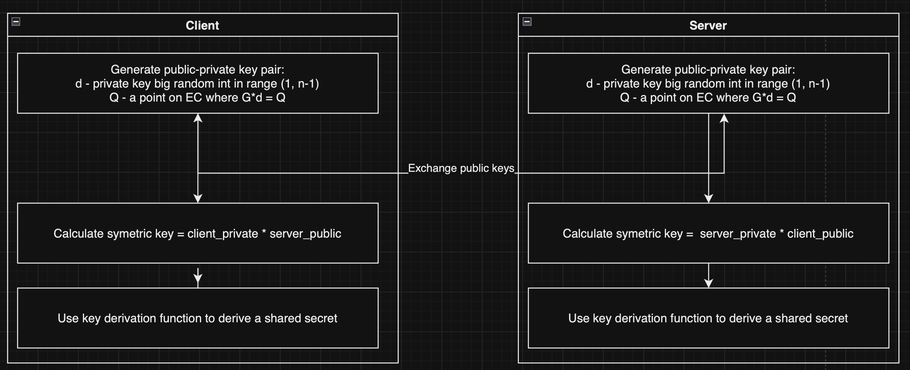

    Average time used:
    - Encryption: 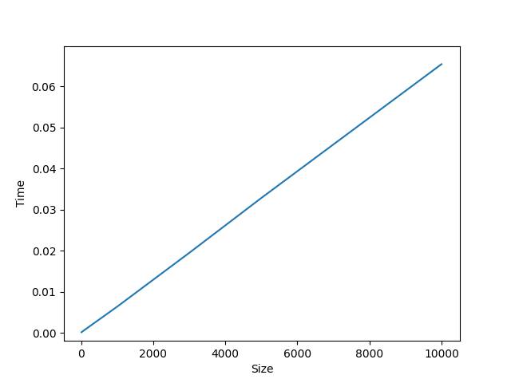
    - Decryption: 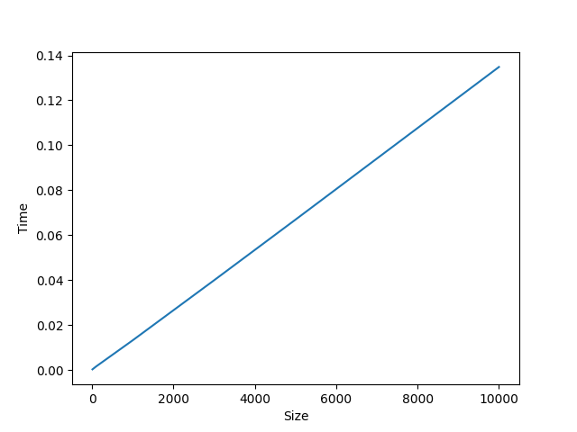
    - Key generation: 0.008 seconds

    Average memory used:
    - Encryption: 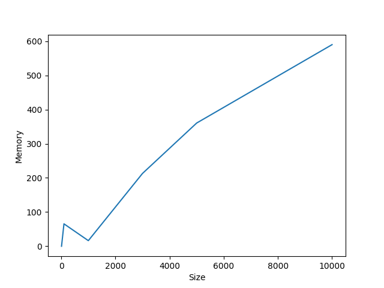
    - Decryption: 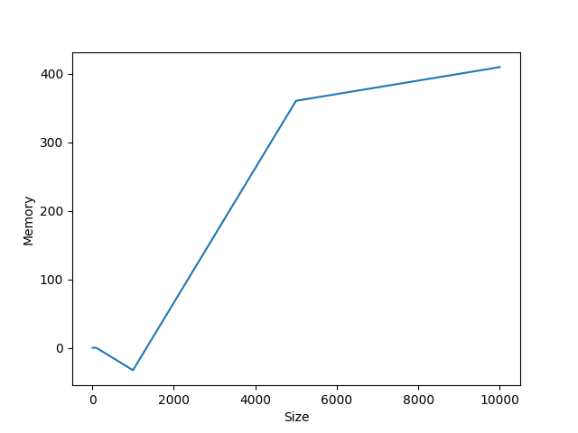
    - Key generation: 16.384 bfytes
- ### RSA algorithm
    Here we use RSA to generate key pairs and then encrypt the message using the public key. The message is then decrypted using the private key. It's faster than ECC+AES-128 but less secure.
    It's one of the most used algorithms in the world. It relies on the difficulty of factoring large numbers. However, with the advent of quantum computers, it's security is in question, because of Shor's algorithm.

    Handshake process:
    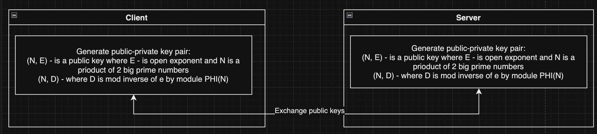

    Average time used:
    - Encryption: 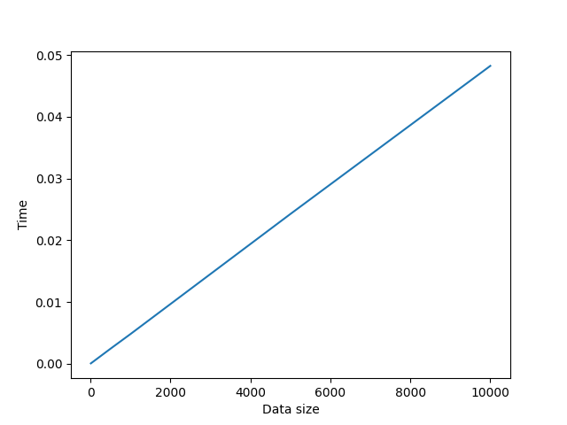
    - Decryption: 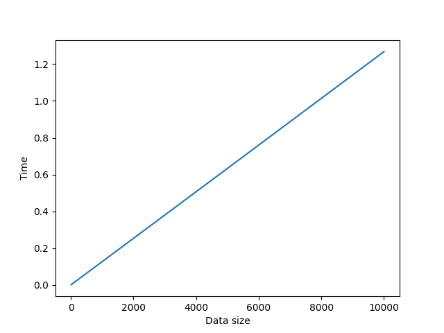
    - Key generation: 0.0039 seconds

    Average memory used:
    - Encryption: 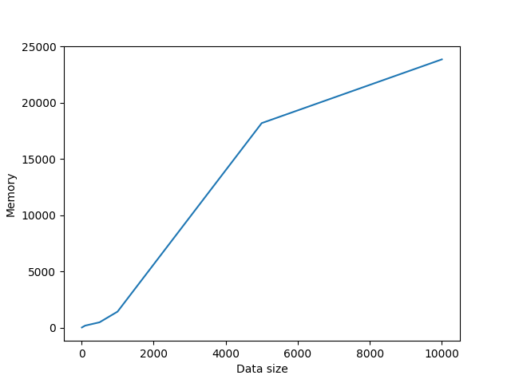
    - Decryption: < 23 mb
    - Key generation: < 3 

- ### ElGamal algorithm
    This algorithm is based on the Diffie-Hellman key exchange algorithm and the problem of computing discrete logorithms of cyclic groups. It's less secure than RSA and ECC+AES-128 but faster. Private keys of these alghoritm can be cracked but you need powerful quantum computer to crack so for now this alghorithm is pretty safe. Also it's security is corelated of hardnes of cyclic group it is based on.

    Handshake process:
    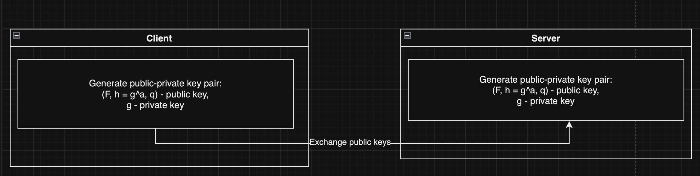

    Average time used:
    - Encryption: 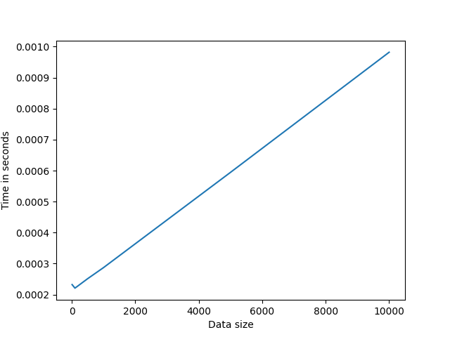
    - Decryption: 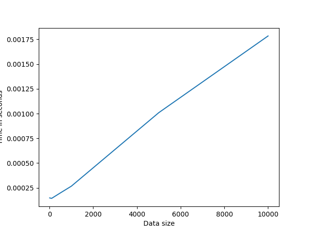
    - Key generation: 0.0001 seconds

    Average memory used:
    - Encryption: 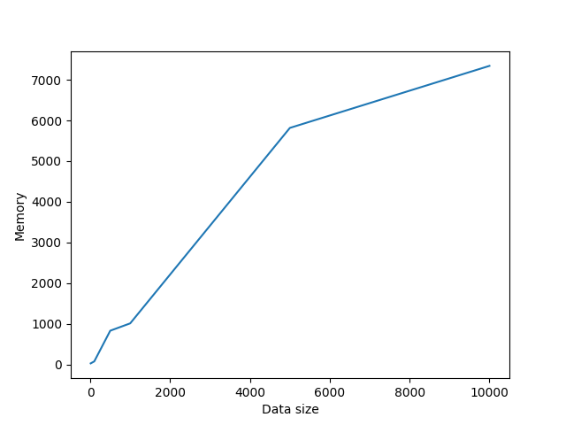
    - Decryption: 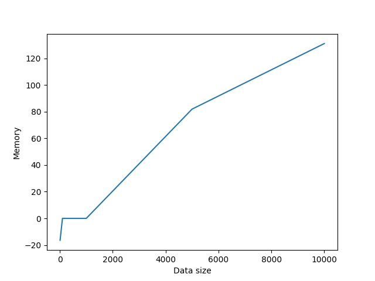
    - Key generation: < 2.048 bytes
- ### Rabin algorithm
    The Rabin cryptosystem is based on the difficulty of factoring large composite numbers, an NP-hard problem. It involves generating a public key from the product of two large primes and using it for encryption. Decryption relies on finding the square roots modulo the product of these primes, which can have multiple solutions. Rabin cryptosystem's security is tied to the challenge of factoring large numbers, making it theoretically secure against classical computers but potentially vulnerable to quantum computing advances.
    We never used this algorithm in the chat app, because it has a limit on the size of the message that can be encrypted.
    
    Handshake process:
    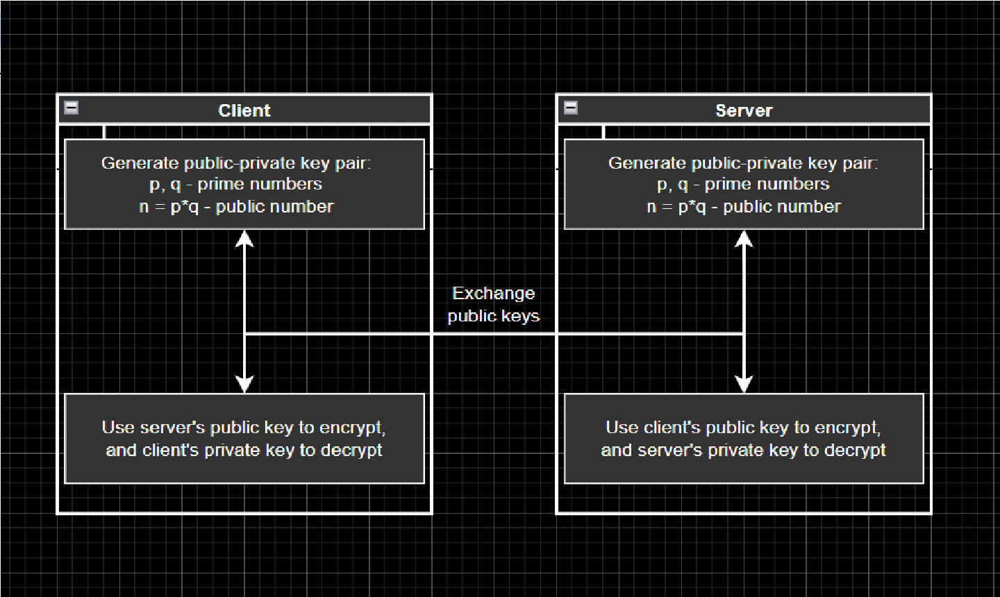

    Average time used:
    - Encryption: 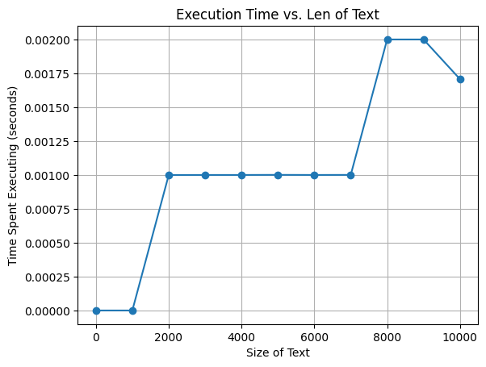
    - Decryption: 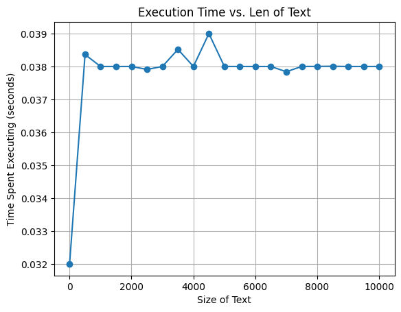
    - Key generation 16.4371 seconds

    Average memory used:
    - Encryption: 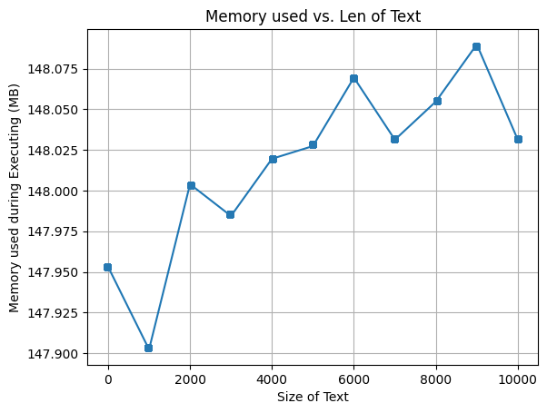
    - Decryption: 
    - Key generation: 151.93 mb

# Conclusion
ECC is one of the most secure algorithms, but it's slower and uses more memory. DSA is a good substitution for plain hash validation, we find it invaluable. RSA is the most used algorithm in the world, but in our opinion with advencment in quantum computing it's security is in question. ElGamal is a good algorithm for small messages, but it's less secure than RSA and ECC. We couldn't use Rabin algorithm in our chat app, because it has a limit on the size of the message that can be encrypted.